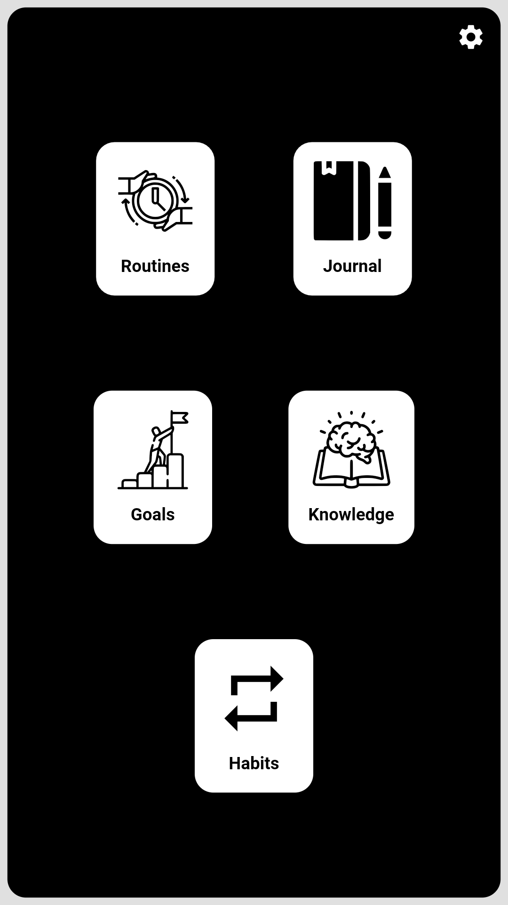
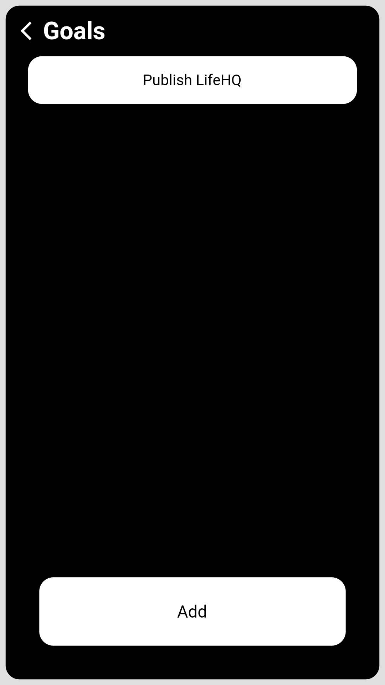

 

Design Your Life

    
    
<!--      -->
    

 

    
    

 
    
    
     
    

# Features:

* Routine
* Journal
* Goals

### Coming Soon:

* habits
* decisions
* Knowledge

# Have Suggestions ?

You can add an issue [here](https://github.com/abhinavmarwaha/lifehq/issues) or fill up a google form [here](https://docs.google.com/forms/d/e/1FAIpQLSdcVAl64UwJg6U6xZ3YnDc8inIsk1WO7-jHpTpRLcl6t4XP7g/viewform?usp=sf_link).

# IOS

I don't have ios dev account so you can download the xarchive [here]() and you can sign and install using [AltStore](https://altstore.io/) 

You can contact me at [abhinavmarwaha@protonmail.com](mailto:abhinavmarwaha@protonmail.com)